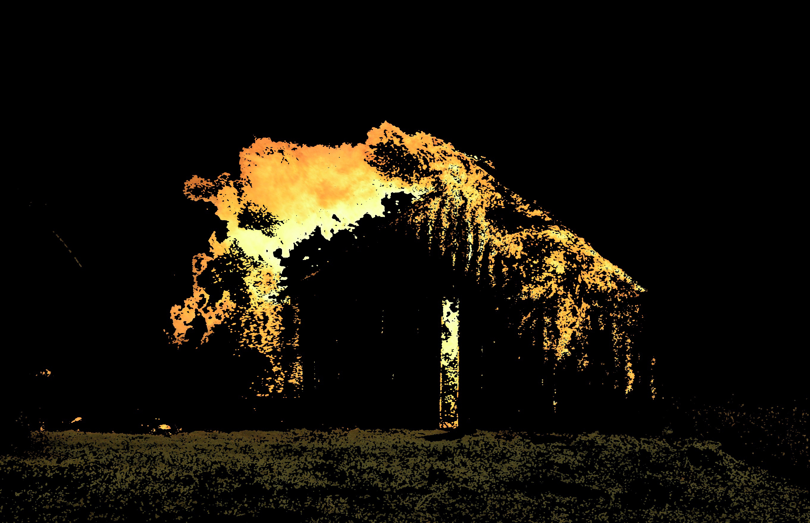

## Progress Report of Fire Detection

1. HSV Colour Space with back projection with low threshold - resulted in an image with too much grass being masked

2. Increased threshold to try and fine tune the mask - resulted in less fire and grass detected but still picking up a lot of grass

3. Converted colour space to YCC - resulted in less fire being masked but also no grass being masked.

4. Created a custom sample of fire images to be used for back projection - resulted in an increase in fire detection but still a fairly noisy mask

5. Added a morphing style as well as dilation of the mask - resulted in an  increase in its area and reduced noise

6. Prefaced the image with a blurring effect - resulted in an increased smoothing on the binary mask

## Testing with Ground Truth Images

1. Invert the binary mask on the ground truth image
2. Count the number of black pixels on the image
3. Apply a difference from the fire detected image onto the ground truth image
4. Count the number of black pixels on the image
5. Take the difference in black pixels between both images and divide that number by the ground truth black pixels.
6. This number * 100 will give the percentage of effectiveness in the algorithm. (The higher the percentage, the better the algorithm)